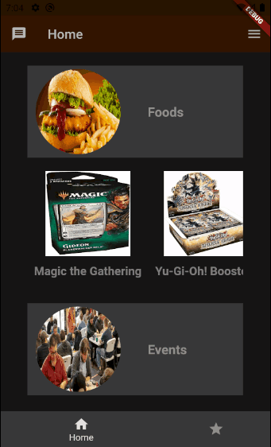
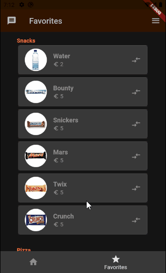
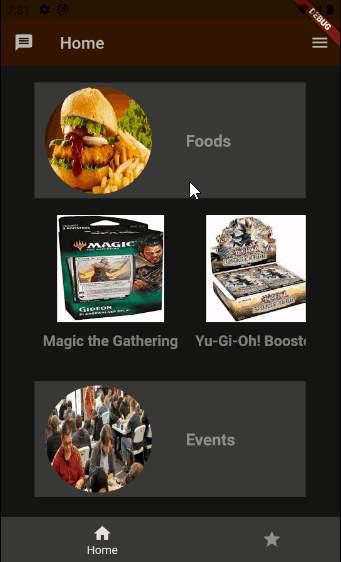
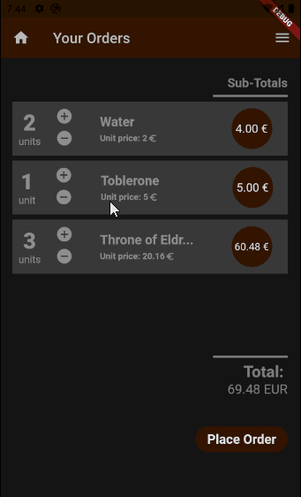

# Flutter_MobileApp
A demo mobile application for a hobby shop where users can view products, manage their own favorite products list, place orders, and do much more.

This is my first demo app (done withing 2-3 weeks, working in my spare times) right after I have completed Flutter & Dart - The Complete Guide 2020 Edition from Academind.

I did my best to cover all the concepts which you can see in today's popular mobile apps. Thus, from basic to advanced, I used variety of Flutter widgets/packages, such as ListView, Slivers, Default/BottomNavBar, StickyHeader, Dismissible, AnimatedContainer, Global theme management, Providers and so on.

     

But still, there is much things to do:
1. Implementing landscape design
2. Cupertione design changes for IOS devices
3. Implementing a live chat module
4. Connect to an API to get rid of dummy data

Please feel free to contact with me regarding any kind of inquiries and would be glad if you advice me about improvements.
